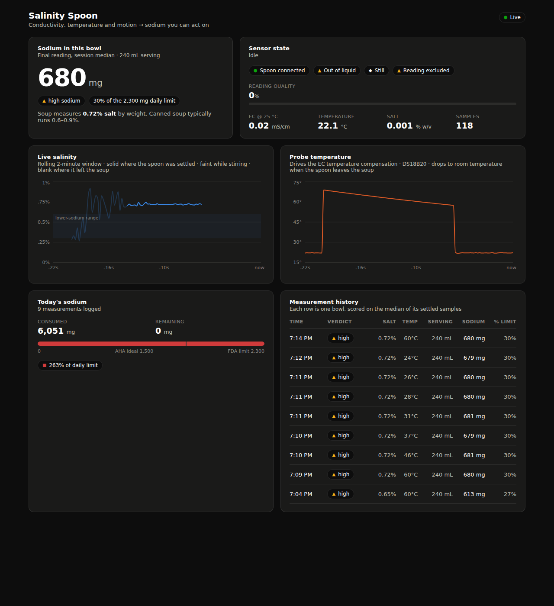

# Salinity Spoon

A spoon that measures the salt in your soup and tells you what that means for
your sodium intake.

An ESP32 reads a conductivity probe, a temperature probe, and an accelerometer,
fuses them into a trust-scored salinity measurement, and streams it to a live
dashboard that reports sodium per serving against daily limits.



---

## Quick start (no hardware needed)

The mock spoon speaks the real telemetry protocol over the real WebSocket, so
the dashboard can be built and demoed before a single wire is soldered.

```bash
# 1. Backend
python3 -m venv .venv
.venv/bin/pip install -r backend/requirements.txt
cd backend && ../.venv/bin/python -m uvicorn app.main:app --host 0.0.0.0 --port 8000

# 2. Mock spoon (new terminal)
.venv/bin/python tools/mock_spoon.py --target 0.72 --scenario cooling

# 3. Dashboard (new terminal)
cd dashboard && npm install && npm run dev
```

Open http://localhost:5173. The mock walks a full tasting cycle — rest, dip,
stir, settle, read, lift — every 23 seconds, so you can watch session detection
and quality gating work.

Useful flags: `--target 0.9` for a saltier soup, `--noise 0.3` to watch the
quality gate reject unstable readings.

`--host 0.0.0.0` on the backend matters: the ESP32 connects from another machine,
so binding to localhost makes the spoon invisible.

---

## How it works

```
ESP32 ──WiFi/WebSocket──► FastAPI ──WebSocket──► React dashboard
  │                          │
  │ EC + temp + IMU          └── SQLite: sessions & samples
  └── fused into one trust-scored sample
```

Everything is built around **one JSON schema** — [`docs/telemetry-schema.md`](docs/telemetry-schema.md).
Firmware, mock, backend, and dashboard all speak it. Change it there first, then
update all four.

### The core idea: the accelerometer decides which readings count

An EC probe waved through air reads near zero. A probe in soup that is being
stirred reads turbulence and bubbles. Charting those as "salinity" gives you a
graph of noise and a sodium figure that is simply wrong.

So every sample carries a `quality` score, fused from three independent signals:

- **submerged?** — EC floor combined with a temperature rise above ambient
- **settled?** — gyroscope magnitude below threshold for a sustained window
- **stable?** — low rolling standard deviation on the EC signal itself

Samples below the threshold are drawn faintly on the live chart and **excluded
from every number the dashboard reports**. A session's salinity is the *median*
of its trusted samples, so one bubble against the probe cannot move your sodium
figure.

The MPU-6050 is not decoration. It is the gate.

### Sessions detect themselves

Nobody wants to press Start before tasting. Dipping the spoon opens a session;
lifting it out for five seconds closes one and writes the summary. `POST
/api/sessions/close` is the manual override for when that misfires on stage.

---

## Layout

| Path | What it is |
|---|---|
| `firmware/spoon/` | ESP32 sketch — sensors, fusion, WebSocket client |
| `backend/app/` | FastAPI — ingest, broadcast, session detection, SQLite |
| `dashboard/` | React + Vite + TypeScript |
| `tools/mock_spoon.py` | Simulator speaking the real protocol |
| `docs/` | Schema, wiring, calibration |

## Hardware

ESP32-WROOM-32 · DFRobot Gravity Analog EC V2 (DFR0300) · DS18B20 · MPU-6050 (GY-521)
· optional ADS1115

**Read [`docs/wiring.md`](docs/wiring.md) before wiring anything** — it covers the
ADC2/WiFi conflict that silently corrupts EC readings, the 5 V output problem,
and the EC probe's temperature limit.

**Read [`docs/calibration.md`](docs/calibration.md) before trusting a number** —
there are *two* calibrations, and doing only the probe one is the usual reason a
salinity reading is confidently wrong.

### Arduino libraries

OneWire · DallasTemperature · Adafruit MPU6050 · ArduinoJson · WebSockets
(Markus Sattler) · [DFRobot_ESP_EC](https://github.com/GreenPonik/DFRobot_ESP_EC_BY_GREENPONIK)
(install as ZIP — not in the Library Manager) · Adafruit ADS1X15 (only with `USE_ADS1115`)

Board: **ESP32 Dev Module**. No COM port? Install the Silicon Labs CP210x VCP
driver — the HiLetgo board uses a CP2102.

---

## Accuracy, honestly

- The DFRobot EC library targets a 5 V 10-bit Arduino ADC. The ESP32's internal
  ADC is noisier and nonlinear, so EC drifts. Median-of-15 filtering makes it
  demo-acceptable; `#define USE_ADS1115` in `config.h` switches to a 16-bit
  external ADC for readings you can defend. Recalibrate after switching.
- Soup is not saline solution. Potassium, glutamate, and dissolved organics all
  conduct, so this measures **salinity as NaCl equivalent**, not salt content.
  Say that out loud rather than overclaiming.
- Sodium per serving assumes a 240 mL bowl. `POST /api/serving` changes it.
- The EC probe is not certified food-safe. Fine for a demo; not a product.

## Status

Skeleton complete and verified end to end against the simulator: a simulated
0.72 % soup reads back as 0.720 %, with stirring samples correctly excluded.
Next up is first light on real hardware — bench each sensor individually per the
sanity checks in `docs/wiring.md`, then run both calibrations.
